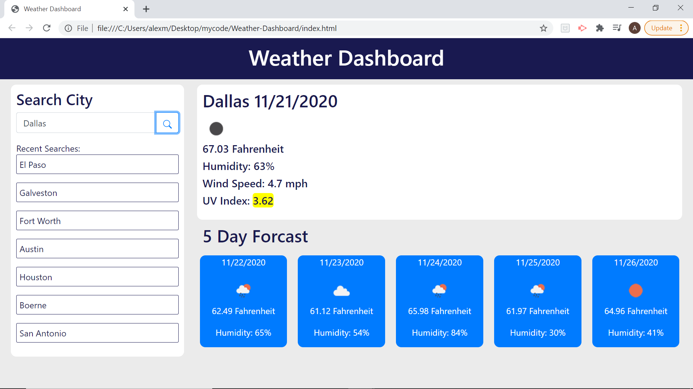

# Weather-Dashboard
In this project I created a weather dashboard utilizing javascript, jquery, moment js, the Open Weather Map API, and bootstrap.
The basic functionality is that when the page loads, your most recent search is taken from local storage and used in the load weather function to populate the current weather fields and five day forecast. When you make a new search the previously searched item is then loaded into the recent search field and can be clicked on to re initialized the results and repopulate the weather fields.

Checkout my deployed application here: https://alexbertuzzi.github.io/Weather-Dashboard/

